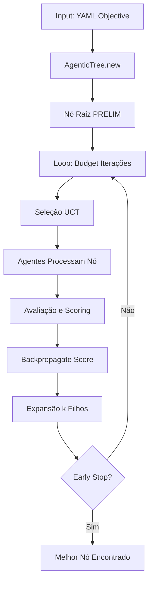
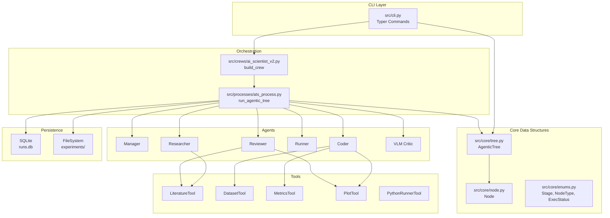
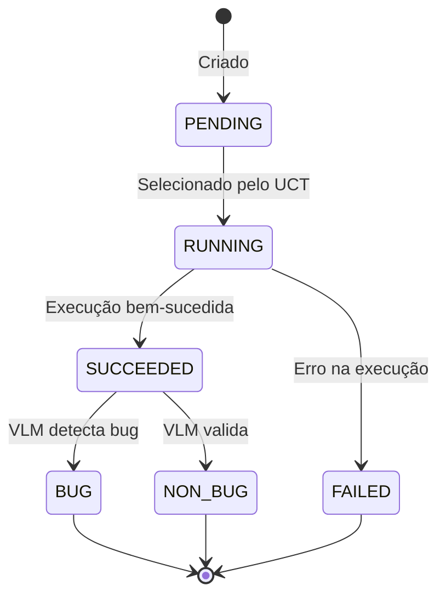
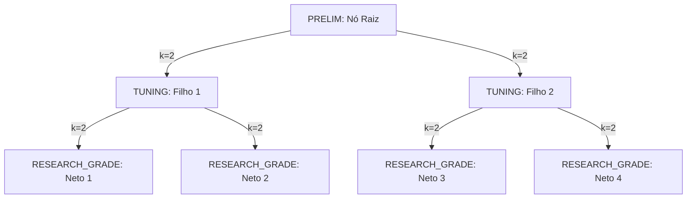
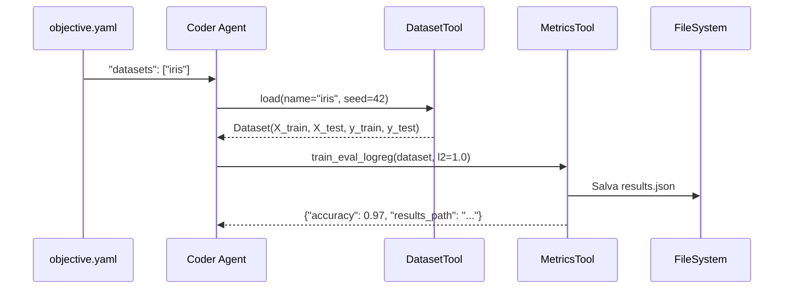
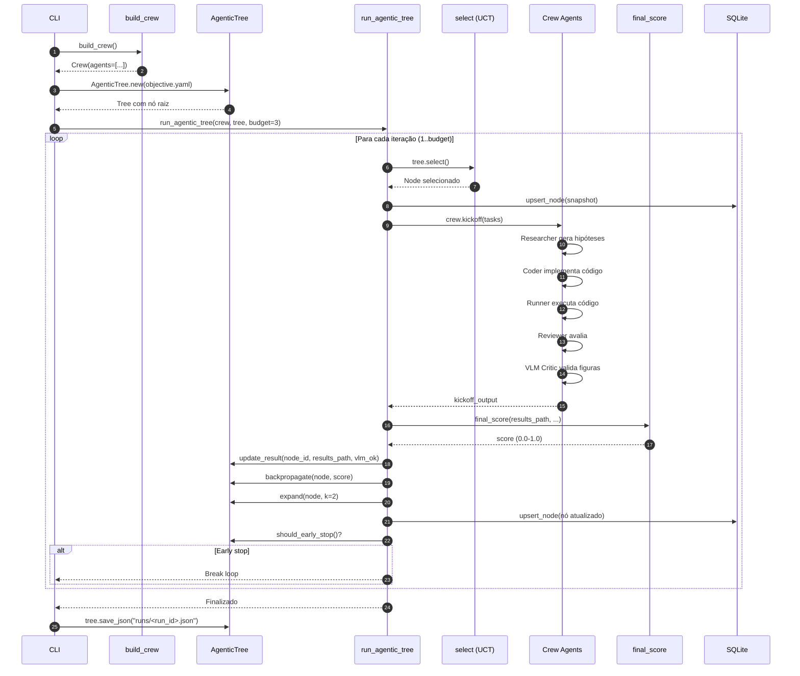
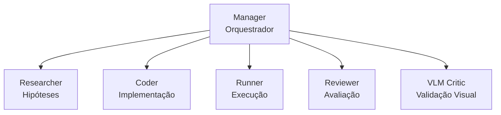
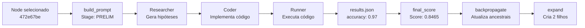

# Documentação Técnica Completa — ChicoCienciaV1

**Versão**: 1.0  
**Data**: 2025-10-25  
**Autor**: Análise técnica do sistema

---

## Índice

1. [Visão Geral do Sistema](#1-visão-geral-do-sistema)
2. [Formato de Input (YAML Objectives)](#2-formato-de-input-yaml-objectives)
3. [Arquitetura e Componentes](#3-arquitetura-e-componentes)
4. [Evolução da Árvore de Busca](#4-evolução-da-árvore-de-busca)
5. [Integração do Dataset Iris](#5-integração-do-dataset-iris)
6. [Fluxo Completo de Execução](#6-fluxo-completo-de-execução)
7. [Agentes e Responsabilidades](#7-agentes-e-responsabilidades)
8. [Sistema de Scoring](#8-sistema-de-scoring)
9. [Exemplos Práticos](#9-exemplos-práticos)

---

## 1. Visão Geral do Sistema

### 1.1 Conceito Fundamental

O **ChicoCienciaV1** é um sistema de descoberta científica autônoma que combina:

- **Agentic Tree Search (ATS)**: Busca em árvore orientada por agentes para explorar espaço de hipóteses
- **CrewAI**: Orquestração hierárquica de agentes especializados (LLMs)
- **Múltiplos Estágios**: Progressão de PRELIM → TUNING → RESEARCH_GRADE → ABLATIONS
- **Avaliação Multi-Critério**: Score composto por métrica primária, novidade, robustez e consistência VLM

### 1.2 Princípio de Funcionamento



**Objetivo**: Explorar sistematicamente o espaço de hipóteses experimentais, balanceando exploração (novos caminhos) e exploração (caminhos promissores), até encontrar soluções que atendam critérios de qualidade científica.

---

## 2. Formato de Input (YAML Objectives)

### 2.1 Estrutura Básica

O input do sistema é um arquivo YAML que define o **objetivo científico** a ser investigado. Este arquivo é carregado e serializado como JSON para servir como prompt inicial do nó raiz.

**Localização**: `objective.example.yaml`, `objective.live.yaml`

### 2.2 Schema Completo

```yaml
objective:
  # Campos obrigatórios
  title: "Título descritivo do experimento"
  primary_metric: "accuracy"  # ou "f1", "precision", etc.
  
  # Campos opcionais mas recomendados
  question: "Pergunta de pesquisa específica"
  datasets: ["iris"]  # Lista de datasets a usar
  dataset: "iris"      # Alternativa: dataset único (legado)
  
  # Hipóteses iniciais (opcional)
  hypotheses:
    - "Hipótese 1 testável"
    - "Hipótese 2 testável"
  
  # Constraints experimentais
  constraints:
    - "Reprodutibilidade (seed fixo)"
    - "Training time below 60s per run"
    - "No human-authored code templates"
  
  # Requisitos de visualização
  figures:
    - "Lineplot: accuracy vs C (inverso do L2)"
    - "Heatmap: confusion matrix"
  
  # Query para busca de literatura
  literature_query: "logistic regression iris regularization reproducibility"
  
  # Critérios de aceitação
  acceptance_criteria:
    min_improvement: 0.02  # Melhoria mínima esperada
  
  # Considerações éticas (opcional)
  ethical:
    - "Always report negative results"
    - "Disclose seeds, datasets and limitations"
```

### 2.3 Exemplo Real: `objective.live.yaml`

```yaml
objective:
  title: "Regularização L2 melhora acurácia no Iris"
  primary_metric: accuracy
  question: "Qual impacto de L2 e dropout leve na generalização vs baseline?"
  datasets: ["iris"]
  figures:
    - "Lineplot: accuracy vs C (inverso do L2)"
  constraints:
    - "Reprodutibilidade (seed fixo)"
    - "Salvar results.json e figuras por nó"
  literature_query: "logistic regression iris regularization reproducibility"
  acceptance_criteria:
    min_improvement: 0.02
```

### 2.4 Processamento do Input

**Código**: `src/core/tree.py:21-34`

```python
@classmethod
def new(cls, objective_yaml: str, artifact_root: str = "./experiments"):
    import yaml
    obj = yaml.safe_load(Path(objective_yaml).read_text())
    primary_metric = obj.get("objective", {}).get("primary_metric", "accuracy")
    tree = cls(obj, primary_metric, artifact_root)
    root_id = tree._add_node(
        parent_id=None,
        type=NodeType.HYPOTHESIS,
        stage=Stage.PRELIM,
        prompt=json.dumps(obj["objective"], ensure_ascii=False),  # Serializa como JSON
        plan=None
    )
    tree.frontier.append(root_id)
    return tree
```

**Transformações**:
1. YAML → Dict Python (`yaml.safe_load`)
2. Extração de `primary_metric` (default: `"accuracy"`)
3. Serialização do `objective` como JSON string (para prompt)
4. Criação do nó raiz com `stage=PRELIM`
5. Adição à `frontier` (fila de nós candidatos)

---

## 3. Arquitetura e Componentes

### 3.1 Componentes Principais



### 3.2 Estrutura de Dados: Node

**Definição**: `src/core/node.py`

```python
@dataclass
class Node:
    id: str                          # UUID curto (8 chars)
    parent_id: Optional[str]         # ID do nó pai (None para raiz)
    type: NodeType                   # HYPOTHESIS, HYPERPARAM, etc.
    stage: Stage                     # PRELIM, TUNING, RESEARCH_GRADE, ABLATIONS
    prompt: str                      # JSON string do objective
    plan: str | None                 # Plano experimental gerado pelo Researcher
    code_path: str | None            # Caminho para código Python gerado
    results_path: str | None         # Caminho para results.json
    figs_paths: List[str]            # Lista de caminhos para figuras PNG
    score: float | None               # Score final calculado
    visits: int                       # Número de vezes visitado (para UCT)
    value_sum: float                  # Soma acumulada de scores (para UCT)
    status: ExecStatus                # PENDING, RUNNING, SUCCEEDED, FAILED, etc.
    meta: Dict[str, Any]             # Metadados adicionais
```

**Campos Críticos**:
- `visits` e `value_sum`: Usados pelo algoritmo UCT para balancear exploração/exploração
- `score`: Calculado por `final_score()` após execução
- `stage`: Determina qual prompt template usar (`build_prompt()`)

---

## 4. Evolução da Árvore de Busca

### 4.1 Algoritmo de Seleção: UCT (Upper Confidence Bound for Trees)

**Código**: `src/core/tree.py:42-53`

```python
def select(self) -> Node:
    candidates = [self.nodes[i] for i in self.frontier] if self.frontier else list(self.nodes.values())
    total_visits = sum(max(1, n.visits) for n in candidates)
    c = self.settings.UCT_C  # Constante de exploração (default: 1.414)
    
    def uct(n: Node) -> float:
        avg = (n.value_sum / n.visits) if n.visits > 0 else 0.0  # Exploração
        explore = c * math.sqrt(math.log(total_visits) / max(1, n.visits))  # Exploração
        return avg + explore
    
    return max(candidates, key=uct)
```

**Fórmula UCT**:
```
UCT(n) = (value_sum / visits) + C * sqrt(ln(total_visits) / visits)
         └─ Exploração ─┘     └─────── Exploração ─────────┘
```

**Interpretação**:
- **Exploração** (`avg`): Média de scores observados (favorece nós com bons resultados)
- **Exploração** (`explore`): Termo que aumenta para nós pouco visitados (favorece exploração)
- **C** (`UCT_C`): Constante que controla o trade-off (maior C = mais exploração)

### 4.2 Ciclo de Vida de um Nó



### 4.3 Expansão da Árvore

**Código**: `src/core/tree.py:55-66`

```python
def expand(self, node: Node, k: int = 2) -> list[str]:
    child_ids = []
    for _ in range(k):  # Expansão binária por padrão
        child_ids.append(self._add_node(
            parent_id=node.id,
            type=node.type,  # Herda tipo do pai
            stage=node.stage,  # Será atualizado depois
            prompt=node.prompt,  # Herda prompt (pode ser modificado pelo Researcher)
            plan=node.plan or "Auto-generated plan stub."
        ))
    self.frontier.extend(child_ids)  # Adiciona à fronteira
    return child_ids
```

**Progressão de Estágios**: `src/prompts/stages.py:38-45`

```python
def next_stage(current: Stage) -> Stage:
    if current == Stage.PRELIM:
        return Stage.TUNING
    if current == Stage.TUNING:
        return Stage.RESEARCH_GRADE
    if current == Stage.RESEARCH_GRADE:
        return Stage.ABLATIONS
    return Stage.ABLATIONS  # Terminal
```

**Fluxo de Expansão**:



**Observação**: Os filhos são criados com o mesmo `stage` do pai, mas após a criação, `next_stage()` é aplicado para avançar o estágio.

### 4.4 Backpropagação de Scores

**Código**: `src/core/tree.py:75-82`

```python
def backpropagate(self, node: Node, score: float):
    cur: Optional[Node] = node
    while cur is not None:
        cur.visits += 1           # Incrementa visitas
        cur.value_sum += score    # Acumula score
        cur.score = max(cur.score or 0.0, score)  # Mantém melhor score
        cur = self.nodes.get(cur.parent_id) if cur.parent_id else None
```

**Efeito**: Propaga o score do nó executado até a raiz, atualizando estatísticas UCT de todos os ancestrais. Isso permite que a seleção futura considere o histórico de sucesso de cada ramo.

### 4.5 Early Stopping

**Código**: `src/core/tree.py:84-86`

```python
def should_early_stop(self, threshold: float = 0.72) -> bool:
    best = max((n.score or 0.0) for n in self.nodes.values())
    return best >= threshold
```

**Lógica**: Se algum nó alcança score acima do threshold (`EARLY_STOP_SCORE`), a busca pode parar antecipadamente.

---

## 5. Integração do Dataset Iris

### 5.1 DatasetTool: Interface de Carregamento

**Código**: `src/tools/datasets.py`

```python
class DatasetTool:
    name = "dataset_tool"
    
    def load(self, name: str = "iris", test_size: float = 0.25, seed: int = 42) -> Dataset:
        from sklearn import datasets as skds
        from sklearn.model_selection import train_test_split
        
        if name == "iris":
            data = skds.load_iris()
        else:
            raise ValueError(f"Dataset '{name}' não suportado.")
        
        X_train, X_test, y_train, y_test = train_test_split(
            data.data, data.target, test_size=test_size, random_state=seed
        )
        return Dataset(X_train, X_test, y_train, y_test, name)
```

**Estrutura Dataset**:

```python
@dataclass
class Dataset:
    X_train: list  # Features de treino (150 * 0.75 = 112 amostras)
    X_test: list   # Features de teste (150 * 0.25 = 38 amostras)
    y_train: list # Labels de treino
    y_test: list  # Labels de teste
    name: str     # "iris"
```

### 5.2 Características do Iris Dataset

- **Tamanho**: 150 amostras (3 classes × 50 amostras)
- **Features**: 4 dimensões (sepal length, sepal width, petal length, petal width)
- **Classes**: 3 (Setosa, Versicolor, Virginica)
- **Split padrão**: 75% treino / 25% teste (`test_size=0.25`)
- **Seed fixo**: `42` (garante reprodutibilidade)

### 5.3 Uso no Contexto do Sistema

**Fluxo de Integração**:



**Exemplo de Código Gerado** (conceitual):

```python
# experiments/<node_id>/code.py (gerado pelo Coder)
from src.tools.datasets import DatasetTool
from src.tools.metrics import MetricsTool

dataset_tool = DatasetTool()
metrics_tool = MetricsTool()

# Carrega Iris com seed fixo
dataset = dataset_tool.load(name="iris", test_size=0.25, seed=42)

# Treina Logistic Regression com L2
results = metrics_tool.train_eval_logreg(
    dataset=dataset,
    l2=1.0,  # Parâmetro de regularização
    max_iter=200,
    out_path=f"./experiments/{node_id}/results.json"
)

print(f"Accuracy: {results['accuracy']}")
```

### 5.4 Por Que Iris?

**Vantagens para Testes**:
1. **Simplicidade**: Dataset pequeno e bem conhecido
2. **Rapidez**: Treinamento em milissegundos
3. **Reprodutibilidade**: Resultados determinísticos com seed fixo
4. **Validação**: Baseline conhecido (~97% accuracy com Logistic Regression)
5. **Visualização**: 4D pode ser reduzido para 2D para plots

**Limitações**:
- Dataset muito simples para problemas reais
- Não testa escalabilidade
- Overfitting raro devido ao tamanho pequeno

**Próximos Passos**: Sistema pode ser estendido para outros datasets (ex: `wine`, `digits`) via extensão do `DatasetTool`.

---

## 6. Fluxo Completo de Execução

### 6.1 Pipeline Principal

**Código**: `src/processes/ats_process.py:27-159`



### 6.2 Detalhamento por Estágio

#### Estágio PRELIM (Preliminar)

**Prompt Template**: `src/prompts/stages.py:7-10`

```
"Você é um pesquisador gerando hipóteses iniciais. Dado o objetivo, 
proponha 2-3 hipóteses testáveis, cada uma com um plano sucinto 
(dataset, métrica primária, análise e figura esperada)."
```

**Agente Principal**: `Researcher`  
**Output Esperado**: Hipóteses iniciais e planos experimentais básicos

#### Estágio TUNING (Ajuste de Hiperparâmetros)

**Prompt Template**: `src/prompts/stages.py:11-14`

```
"Você é um experimentador ajustando hiperparâmetros para melhorar 
a métrica primária. Proponha variações (até 3) com justificativa 
e passos reprodutíveis."
```

**Agente Principal**: `Coder` (com `MetricsTool`)  
**Output Esperado**: Variações de hiperparâmetros (ex: `C=[0.1, 1.0, 10.0]` para L2)

#### Estágio RESEARCH_GRADE (Nível de Publicação)

**Prompt Template**: `src/prompts/stages.py:15-18`

```
"Você é um pesquisador preparando um experimento de nível publicável. 
Defina protocolo rigoroso, controles, riscos e critérios de exclusão."
```

**Agente Principal**: `Reviewer` + `VLM Critic`  
**Output Esperado**: Protocolo completo, validação de figuras, relatório

#### Estágio ABLATIONS (Ablações)

**Prompt Template**: `src/prompts/stages.py:19-22`

```
"Você fará ablações. Que componentes remover/alterar para confirmar 
contribuição? Defina 2-3 ablações e resultados esperados."
```

**Agente Principal**: `Researcher` + `Coder`  
**Output Esperado**: Experimentos de ablação (ex: remover L2, variar seed)

### 6.3 Modo Dry-Run vs Real

**Detecção**: `src/processes/ats_process.py:29`

```python
dry_run = settings.OPENAI_API_KEY is None
```

**Comportamento Dry-Run**:
- Não chama `crew.kickoff()`
- Gera `results.json` sintético: `{"accuracy": 0.5}`
- Usa planos stub: `"Auto-generated plan stub."`
- Literatura retorna mocks

**Comportamento Real**:
- Chama `crew.kickoff(tasks)` com agentes LLM reais
- Gera código Python executável
- Executa código em sandbox
- Retorna resultados reais do dataset

---

## 7. Agentes e Responsabilidades

### 7.1 Hierarquia de Agentes

**Processo**: `Process.hierarchical` (CrewAI)



### 7.2 Manager

**Arquivo**: `src/agents/manager.py`

- **Role**: "Experiment Progress Manager"
- **Goal**: Orquestrar descoberta científica em 4 estágios; definir orçamento e critérios; selecionar/expandir nós
- **Tools**: `LiteratureTool`
- **Responsabilidade**: Decisões estratégicas sobre qual nó explorar

### 7.3 Researcher

**Arquivo**: `src/agents/researcher.py`

- **Role**: "Researcher"
- **Goal**: Gerar hipóteses e planos experimentais com revisão de literatura e novidade
- **Tools**: `LiteratureTool`
- **Output**: Hipóteses testáveis, planos experimentais, revisão de literatura

**Exemplo de Output** (conceitual):
```
Hipótese 1: Regularização L2 com C=1.0 melhora generalização em 2-5%
Plano: Treinar LogisticRegression com C=1.0, avaliar accuracy, comparar com baseline
Literatura: [Paper 1 sobre L2, Paper 2 sobre Iris]
```

### 7.4 Coder

**Arquivo**: `src/agents/coder.py`

- **Role**: "Coder"
- **Goal**: Converter planos em código executável reprodutível, sem copiar templates humanos; salvar results.json e figuras
- **Tools**: `DatasetTool`, `PythonRunnerTool`, `PlotTool`
- **Output**: Código Python em `experiments/<node_id>/code.py`

**Exemplo de Código Gerado**:
```python
from src.tools.datasets import DatasetTool
from src.tools.metrics import MetricsTool
from src.tools.plotting import PlotTool

dataset_tool = DatasetTool()
metrics_tool = MetricsTool()
plot_tool = PlotTool()

# Carrega dataset
dataset = dataset_tool.load(name="iris", seed=42)

# Treina modelo
results = metrics_tool.train_eval_logreg(dataset, l2=1.0, out_path="./results.json")

# Gera figura
plot_tool.save_lineplot(
    xs=[0.1, 1.0, 10.0],
    ys=[0.95, 0.97, 0.96],
    title="Accuracy vs C (L2)",
    out_path="./accuracy_vs_c.png"
)
```

### 7.5 Runner

**Arquivo**: `src/agents/runner.py`

- **Role**: "Runner"
- **Goal**: Executar scripts em sandbox, capturar stdout/stderr e registrar artefatos
- **Tools**: `PythonRunnerTool`
- **Output**: Resultados de execução (returncode, stdout, stderr)

**Execução**: `src/tools/python_repl.py`

```python
def run_script(self, code_path: str, workdir: str | None = None, timeout: int = 180):
    proc = subprocess.run(
        [sys.executable, code_path],
        cwd=workdir,
        capture_output=True, text=True, timeout=timeout
    )
    return {
        "returncode": proc.returncode,
        "stdout": proc.stdout[-4000:],  # Últimos 4KB
        "stderr": proc.stderr[-4000:],
    }
```

### 7.6 Reviewer

**Arquivo**: `src/agents/reviewer.py`

- **Role**: "Reviewer"
- **Goal**: Avaliar resultados, reportar negativos, verificar coerência com hipóteses e sugerir próximos passos
- **Tools**: `PlotTool`, `LiteratureTool`
- **Output**: Avaliação crítica, sugestões de melhorias

### 7.7 VLM Critic

**Arquivo**: `src/agents/vlm_critic.py`

- **Role**: "VLM Critic"
- **Goal**: Revisar figuras geradas e classificar BUG/NON_BUG usando modelo de visão
- **Tools**: (usa modelo de visão via OpenAI API)
- **Output**: Classificação `vlm_ok: bool` (afeta `vlm_consistency_score`)

---

## 8. Sistema de Scoring

### 8.1 Fórmula de Score Final

**Código**: `src/core/scoring.py:23-31`

```python
def final_score(results_path: str, primary_metric: str, *,
                literature_overlap: float = 0.5, replications: int = 0,
                agreement: float = 0.5, vlm_ok: bool = True) -> float:
    m = metric_score(results_path, primary_metric)        # 45%
    n = novelty_score(literature_overlap)                  # 20%
    r = robustness_score(replications, agreement)          # 25%
    v = vlm_consistency_score(vlm_ok)                      # 10%
    return round(0.45*m + 0.2*n + 0.25*r + 0.10*v, 4)
```

**Fórmula**:
```
Score = 0.45 × Métrica_Primária + 0.20 × Novidade + 0.25 × Robustez + 0.10 × Consistência_VLM
```

### 8.2 Componentes do Score

#### 8.2.1 Métrica Primária (45%)

**Código**: `src/core/scoring.py:4-10`

```python
def metric_score(results_path: str, primary_metric: str = "accuracy") -> float:
    data = json.loads(Path(results_path).read_text())
    val = float(data.get(primary_metric, 0.0))
    return max(0.0, min(1.0, val))  # Clamp [0, 1]
```

**Exemplo**: Se `results.json` contém `{"accuracy": 0.97}`, então `m = 0.97`.

#### 8.2.2 Novidade (20%)

**Código**: `src/core/scoring.py:12-14`

```python
def novelty_score(literature_overlap: float = 0.5) -> float:
    return max(0.0, min(1.0, 1.0 - literature_overlap))
```

**Lógica**: Quanto maior o overlap com literatura existente, menor a novidade.  
**Default**: `0.5` (overlap médio) → `novelty = 0.5`

#### 8.2.3 Robustez (25%)

**Código**: `src/core/scoring.py:16-18`

```python
def robustness_score(replications: int, agreement: float) -> float:
    return max(0.0, min(1.0, (0.3 * min(replications/5,1.0) + 0.7 * agreement)))
```

**Lógica**: Combina número de replicações (peso 0.3) com acordo entre replicações (peso 0.7).  
**Default**: `replications=0`, `agreement=0.5` → `robustness = 0.35`

#### 8.2.4 Consistência VLM (10%)

**Código**: `src/core/scoring.py:20-21`

```python
def vlm_consistency_score(vlm_ok: bool) -> float:
    return 1.0 if vlm_ok else 0.4
```

**Lógica**: Penaliza se VLM detecta bugs nas figuras.  
**Default**: `vlm_ok=True` → `vlm_consistency = 1.0`

### 8.3 Exemplo de Cálculo

**Cenário**: Nó com `accuracy=0.97`, `literature_overlap=0.3`, `replications=2`, `agreement=0.8`, `vlm_ok=True`

```
m = 0.97
n = 1.0 - 0.3 = 0.7
r = 0.3 × min(2/5, 1.0) + 0.7 × 0.8 = 0.3 × 0.4 + 0.56 = 0.68
v = 1.0

Score = 0.45 × 0.97 + 0.20 × 0.7 + 0.25 × 0.68 + 0.10 × 1.0
      = 0.4365 + 0.14 + 0.17 + 0.10
      = 0.8465
```

---

## 9. Exemplos Práticos

### 9.1 Execução Completa: Run `5c31eab5`

**Comando**:
```bash
python -m src.cli init objective.live.yaml --budget 3 --out-dir runs
```

**Input** (`objective.live.yaml`):
```yaml
objective:
  title: "Regularização L2 melhora acurácia no Iris"
  primary_metric: accuracy
  datasets: ["iris"]
  literature_query: "logistic regression iris regularization reproducibility"
```

**Evolução da Árvore**:

```
Iteração 1:
  Seleciona: 472e67be (PRELIM, raiz)
  Score: 0.5125 (sintético em dry-run)
  Expande: fa67fb62, 147de9e8 (TUNING)

Iteração 2:
  Seleciona: fa67fb62 (TUNING)
  Score: 0.5125
  Expande: 58eb20d7, 1494f6d3 (RESEARCH_GRADE)

Iteração 3:
  Seleciona: 147de9e8 (TUNING)
  Score: 0.5125
  Expande: ff18518a, d9158eaf (RESEARCH_GRADE)
```

**Artefatos Gerados**:
- `runs/5c31eab5.json`: Estado completo da árvore (7 nós)
- `experiments/472e67be/results.json`: `{"accuracy": 0.5}`
- `experiments/fa67fb62/results.json`: `{"accuracy": 0.5}`

### 9.2 Estrutura de Diretórios

```
ChicoCienciaV1/
├── objective.live.yaml          # Input do experimento
├── runs/
│   ├── 5c31eab5.json           # Estado da árvore
│   ├── 5c31eab5.md             # Relatório gerado
│   └── 5c31eab5_investigacao.md # Documentação técnica
├── experiments/
│   ├── 472e67be/
│   │   └── results.json        # Resultados do nó
│   ├── fa67fb62/
│   │   └── results.json
│   └── ...
└── runs.db                      # SQLite (persistência)
```

### 9.3 Fluxo de Dados: Nó Individual



---

## 10. Conclusão

O **ChicoCienciaV1** é um sistema complexo que combina:

1. **Busca em árvore inteligente** (UCT) para explorar espaço de hipóteses
2. **Agentes LLM especializados** para gerar hipóteses, código e avaliações
3. **Integração com datasets** (Iris como exemplo) para validação empírica
4. **Scoring multi-critério** que balanceia métrica, novidade, robustez e consistência
5. **Progressão por estágios** que evolui de hipóteses preliminares até ablações

**Próximos Passos**:
- Executar testes ao vivo com APIs reais
- Estender para outros datasets além de Iris
- Implementar cache de literatura
- Adicionar métricas de qualidade dos outputs dos agentes

---

**Documento gerado em**: 2025-10-25  
**Última atualização**: Análise técnica completa do sistema

