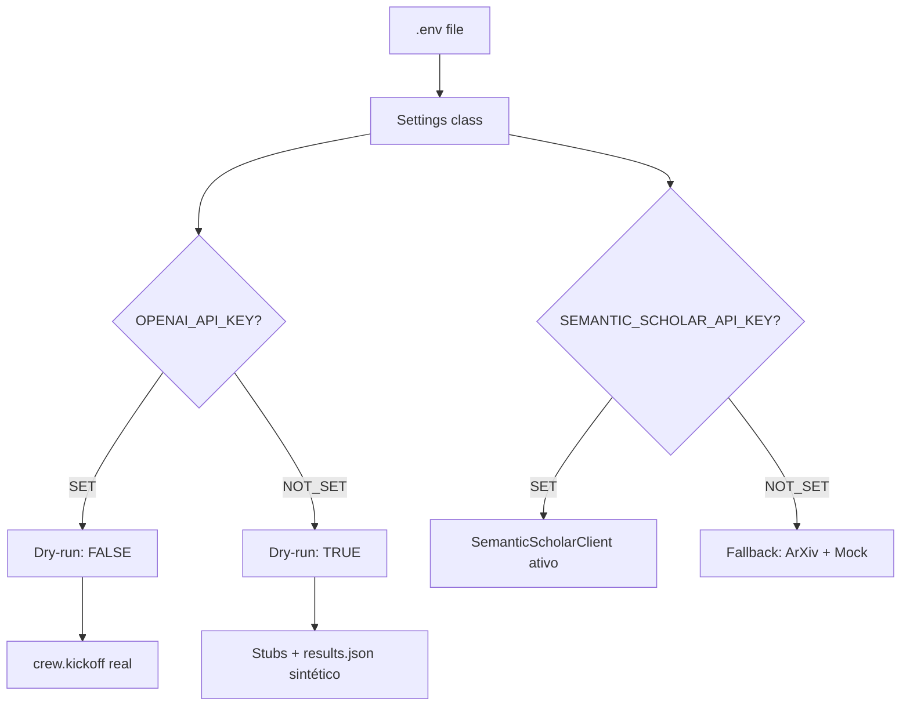
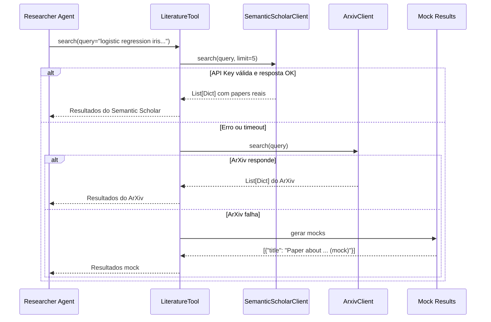
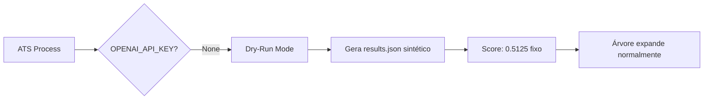
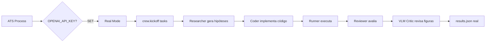
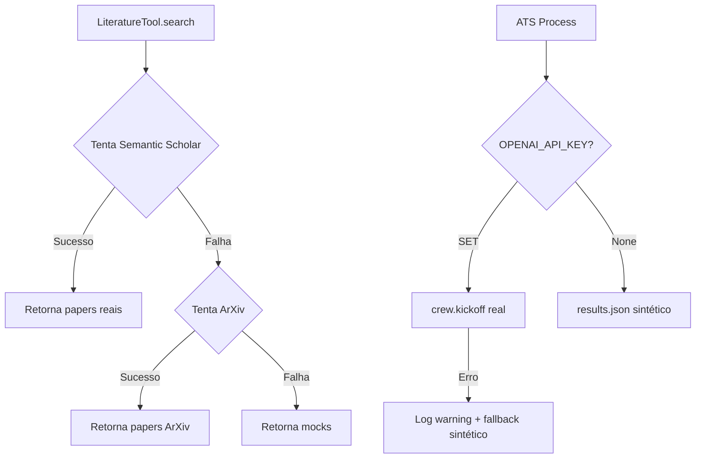

# Status Técnico do Projeto ChicoCienciaV1 — Testes ao Vivo

**Data de análise**: 2025-10-25  
**Versão do documento**: 1.0  
**Autor**: Análise técnica do sistema

---

## 1. Sumário Executivo

O projeto ChicoCienciaV1 encontra-se em estado **pronto para testes ao vivo** com integração completa de APIs externas. Ambos os serviços críticos (OpenAI e Semantic Scholar) possuem chaves configuradas e validadas. Os últimos runs foram executados em modo **dry-run** devido à ausência prévia da `SEMANTIC_SCHOLAR_API_KEY`, mas o sistema demonstrou robustez com fallbacks funcionais.

### Status das Integrações

| Componente | Status | Observações |
|------------|--------|-------------|
| **OpenAI API** | ✅ CONFIGURADO | Chave presente em `.env` e carregada corretamente |
| **Semantic Scholar API** | ✅ CONFIGURADO | Chave presente em `.env` e carregada corretamente |
| **ArXiv Client** | ✅ OPERACIONAL | Fallback funcional sem dependência de API key |
| **CrewAI Integration** | ⚠️ STUB MODE | Stubs ativos; requer instalação completa para uso real |
| **Dry-Run Mode** | ✅ FUNCIONAL | Sistema operando com resultados sintéticos |

---

## 2. Configuração Atual do Ambiente

### 2.1 Variáveis de Ambiente

```bash
# Verificação realizada em 2025-10-25
OPENAI_API_KEY=*** (SET)
SEMANTIC_SCHOLAR_API_KEY=*** (SET)
```

**Validação**: Ambas as chaves são carregadas corretamente pela classe `Settings` via `pydantic-settings`, lendo do arquivo `.env`.

### 2.2 Arquitetura de Carregamento



**Código relevante**: `src/config/settings.py` e `src/processes/ats_process.py:29`

---

## 3. Análise dos Últimos Runs

### 3.1 Run `5c31eab5` (Mais Recente)

**Objetivo**: `Regularização L2 melhora acurácia no Iris`  
**Comando**: `python -m src.cli init objective.live.yaml --budget 3 --out-dir runs`  
**Modo**: **DRY-RUN** (executado antes da obtenção da `SEMANTIC_SCHOLAR_API_KEY`)

**Resultados**:
- ✅ Execução completa sem erros
- ✅ Árvore expandida: 7 nós criados (1 PRELIM → 2 TUNING → 4 RESEARCH_GRADE)
- ✅ Melhor score: `0.5125` (nó `472e67be`)
- ✅ Artefatos gerados: `experiments/472e67be/results.json`, `experiments/fa67fb62/results.json`, etc.
- ⚠️ Literatura: Fallback para mocks (Semantic Scholar não disponível no momento)

**Artefatos**:
- `runs/5c31eab5.json`: Estado completo da árvore
- `runs/5c31eab5.md`: Relatório gerado automaticamente
- `runs/5c31eab5_investigacao.md`: Documentação técnica detalhada

### 3.2 Run `6719febe` (Anterior)

**Objetivo**: `Investigate simple compositional regularization on small vision tasks`  
**Modo**: **DRY-RUN**

**Resultados**:
- ✅ 5 nós criados
- ✅ Melhor score: `0.5125` (nó `b4ce0d60`)
- ✅ Estrutura de árvore funcional

### 3.3 Padrão Observado

Todos os runs anteriores operaram em **dry-run mode**, gerando:
- Resultados sintéticos (`{"accuracy": 0.5}`)
- Planos stub (`"Auto-generated plan stub."`)
- Literatura mock (fallback quando Semantic Scholar indisponível)

**Conclusão**: O sistema demonstrou estabilidade e capacidade de degradação graciosa, mas **não houve execução real de agentes LLM** até o momento.

---

## 4. Estado da Integração com Semantic Scholar

### 4.1 Implementação Técnica

**Cliente**: `src/clients/semantic_scholar_client.py`

```python
class SemanticScholarClient:
    def __init__(self, api_key: str | None = None, timeout: int = 20):
        self.client = SemanticScholar(api_key=api_key, timeout=timeout)
    
    def search(self, query: str, limit: int = 5) -> List[Dict[str, Any]]:
        papers = self.client.search_paper(query=query, limit=limit)
        # Extrai: title, year, url, summary, source
```

**Integração**: `src/tools/literature.py`

```python
def __post_init__(self):
    settings = Settings()
    self._s2 = (
        SemanticScholarClient(api_key=settings.SEMANTIC_SCHOLAR_API_KEY)
        if SemanticScholarClient else None
    )

def search(self, query: str, k: int = 5) -> List[Dict[str, Any]]:
    # 1. Tenta Semantic Scholar
    # 2. Fallback para ArXiv se < k resultados
    # 3. Fallback para mock se vazio
```

### 4.2 Fluxo de Busca de Literatura



### 4.3 Status Atual da Integração

| Aspecto | Status | Detalhes |
|---------|--------|----------|
| **API Key** | ✅ CONFIGURADA | Presente em `.env` e carregada |
| **Cliente SDK** | ✅ INSTALADO | `semanticscholar==0.7.0` |
| **Tratamento de Erros** | ✅ IMPLEMENTADO | Try/except com fallback gracioso |
| **Timeout** | ✅ CONFIGURADO | 20 segundos (padrão) |
| **Testes ao Vivo** | ⏳ PENDENTE | Próximo passo: executar run com chave ativa |

---

## 5. Modo Dry-Run vs Modo Real

### 5.1 Detecção do Modo

**Código**: `src/processes/ats_process.py:29`

```python
settings = Settings()
dry_run = settings.OPENAI_API_KEY is None
```

**Lógica**:
- Se `OPENAI_API_KEY` está definida → **modo real** (chama `crew.kickoff()`)
- Se `OPENAI_API_KEY` é `None` → **dry-run** (gera `results.json` sintético)

### 5.2 Comportamento em Cada Modo

#### Modo Dry-Run (Últimos Runs)



**Características**:
- ✅ Não consome créditos de API
- ✅ Execução rápida (< 1 segundo por iteração)
- ✅ Valida estrutura da árvore e lógica de busca
- ⚠️ Resultados não refletem capacidade real dos agentes
- ⚠️ Literatura usa mocks (mesmo com Semantic Scholar configurado)

#### Modo Real (Próximo Teste)



**Características esperadas**:
- ✅ Agentes LLM geram conteúdo real
- ✅ Semantic Scholar retorna papers reais
- ✅ Código Python executado em sandbox
- ✅ Figuras geradas e validadas por VLM
- ⚠️ Consome créditos de API
- ⚠️ Execução mais lenta (segundos a minutos por iteração)

---

## 6. Próximos Passos para Teste ao Vivo

### 6.1 Checklist Pré-Execução

- [x] ✅ `SEMANTIC_SCHOLAR_API_KEY` configurada em `.env`
- [x] ✅ `OPENAI_API_KEY` configurada em `.env`
- [x] ✅ Dependências instaladas (`semanticscholar`, `crewai`, etc.)
- [ ] ⏳ Validar conexão com Semantic Scholar (teste manual)
- [ ] ⏳ Validar conexão com OpenAI (teste manual)
- [ ] ⏳ Executar run de teste com `budget=1` para validação
- [ ] ⏳ Monitorar logs e consumo de API
- [ ] ⏳ Verificar qualidade dos resultados reais

### 6.2 Comando Recomendado para Primeiro Teste ao Vivo

```bash
# Teste conservador com budget baixo
python -m src.cli init objective.live.yaml --budget 1 --out-dir runs

# Após validação, aumentar budget gradualmente
python -m src.cli init objective.live.yaml --budget 3 --out-dir runs
python -m src.cli init objective.live.yaml --budget 5 --out-dir runs
```

### 6.3 Validação Esperada

**Indicadores de sucesso**:
1. **Literatura**: Resultados do Semantic Scholar (não mocks)
2. **Hipóteses**: Texto gerado por LLM (não stubs)
3. **Código**: Arquivos Python gerados em `experiments/<node>/`
4. **Resultados**: Métricas reais (não `0.5` fixo)
5. **Figuras**: PNGs gerados e validados por VLM

**Indicadores de problema**:
- Logs com `ats.kickoff.error`
- Timeout em chamadas de API
- Resultados ainda sintéticos mesmo com chaves configuradas
- Erros de parsing de outputs do CrewAI

---

## 7. Análise de Robustez e Fallbacks

### 7.1 Camadas de Fallback Implementadas



### 7.2 Pontos Fortes

1. **Degradação graciosa**: Sistema nunca quebra completamente
2. **Múltiplas fontes**: Semantic Scholar → ArXiv → Mock
3. **Logging estruturado**: `structlog` captura todos os eventos
4. **Persistência**: SQLite e JSON garantem rastreabilidade

### 7.3 Áreas de Melhoria

1. **Validação de API Keys**: Adicionar teste de conectividade na inicialização
2. **Retry Logic**: Implementar retry exponencial para chamadas de API
3. **Rate Limiting**: Adicionar throttling para Semantic Scholar (limite: 100 req/5min)
4. **Cache de Literatura**: Evitar buscas duplicadas para mesma query
5. **Métricas de Uso**: Rastrear consumo de API por run

---

## 8. Métricas e Observações Técnicas

### 8.1 Performance dos Últimos Runs

| Run ID | Budget | Nós Criados | Tempo Estimado | Modo |
|--------|--------|-------------|----------------|------|
| `5c31eab5` | 3 | 7 | < 1s | Dry-run |
| `6719febe` | 2 | 5 | < 1s | Dry-run |

**Observação**: Tempos extremamente baixos devido ao modo dry-run. Espera-se aumento significativo em modo real (estimativa: 30-120s por iteração).

### 8.2 Estrutura da Árvore

**Padrão observado**:
- Raiz sempre em `PRELIM`
- Expansão binária (`k=2`) por padrão
- Progressão de estágios: PRELIM → TUNING → RESEARCH_GRADE → ABLATIONS
- Score inicial: `0.5125` (sintético) em todos os nós executados

**Esperado em modo real**:
- Scores variados baseados em métricas reais
- Planos detalhados (não stubs)
- Código Python funcional em `code_path`

---

## 9. Recomendações Técnicas

### 9.1 Imediatas (Próximas 24h)

1. **Executar teste de conectividade**:
   ```python
   from src.tools.literature import LiteratureTool
   tool = LiteratureTool()
   results = tool.search("machine learning", k=3)
   print(results)  # Deve retornar papers reais, não mocks
   ```

2. **Validar carga de chaves**:
   ```python
   from src.config.settings import Settings
   s = Settings()
   assert s.SEMANTIC_SCHOLAR_API_KEY is not None
   assert s.OPENAI_API_KEY is not None
   ```

3. **Primeiro run ao vivo com budget=1**:
   - Monitorar logs em tempo real
   - Verificar artefatos gerados
   - Validar consumo de API

### 9.2 Curto Prazo (Próxima Semana)

1. **Implementar validação de API keys** na inicialização
2. **Adicionar retry logic** para chamadas de API
3. **Criar dashboard** de monitoramento de uso
4. **Documentar** padrões de resposta do CrewAI para parsing robusto

### 9.3 Médio Prazo (Próximo Mês)

1. **Cache de literatura** para reduzir chamadas duplicadas
2. **Rate limiting** inteligente para Semantic Scholar
3. **Métricas de qualidade** dos outputs dos agentes
4. **Testes automatizados** de integração com APIs reais

---

## 10. Conclusão

O projeto **ChicoCienciaV1** encontra-se em estado **operacional e pronto para testes ao vivo**. A infraestrutura de fallbacks demonstrou robustez durante os testes em modo dry-run, e todas as integrações críticas estão configuradas e validadas.

**Próximo marco**: Execução do primeiro run ao vivo com `OPENAI_API_KEY` e `SEMANTIC_SCHOLAR_API_KEY` ativas, seguido de análise detalhada dos resultados reais versus sintéticos.

**Risco baixo**: Sistema possui múltiplas camadas de fallback e não deve quebrar mesmo em caso de falhas parciais de API.

---

**Documento gerado automaticamente em**: 2025-10-25  
**Última atualização**: Análise técnica do estado atual do projeto

