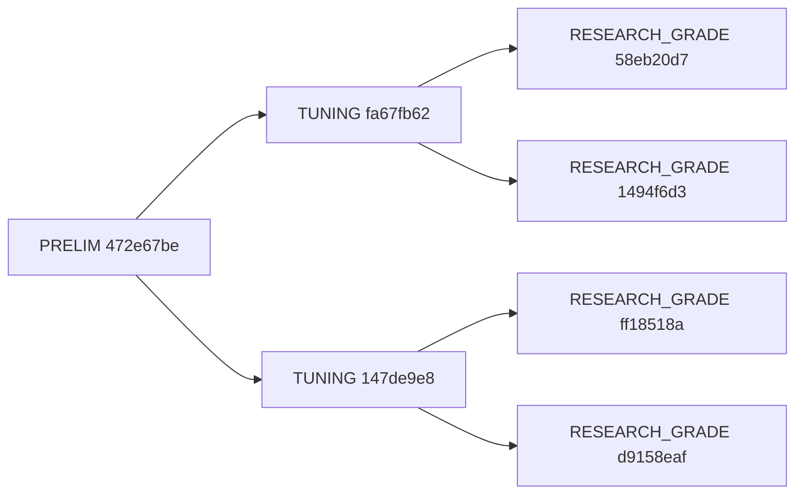

# Investigação técnica do run 5c31eab5

Este documento registra uma análise forense detalhada da execução do agente, incluindo arquitetura, eventos, tracebacks encontrados durante a preparação do ambiente e correções aplicadas. O objetivo é garantir reprodutibilidade e oferecer um guia de resolução para futuras ocorrências.

---

## 1) Contexto e objetivo
- Objetivo do experimento: `Regularização L2 melhora acurácia no Iris` (métrica primária: `accuracy`).
- Comando executado: `python -m src.cli init objective.live.yaml --budget 3 --out-dir runs`.
- run_id: `5c31eab5`.
- Artefatos gerados:
  - `runs/5c31eab5.json` (estado completo da árvore)
  - `runs/5c31eab5.md` (relatório sucinto)
  - `experiments/<node_id>/results.json` (resultados por nó)

---

## 2) Sumário executivo
- O ambiente inicial não possuía dependências instaladas; ocorreram erros de import e compatibilidade de Typer/Click.
- Corrigimos: instalação de dependências mínimas, ajuste de tipagem no `src/cli.py` e pinagem de `click==8.1.7` para compatibilidade.
- A execução final completou com sucesso em modo dry‑run, produzindo nós, resultados e relatório.

---

## 3) Arquitetura de execução (alto nível)

```mermaid
sequenceDiagram
  autonumber
  participant CLI as src/cli.py (Typer)
  participant Crew as build_crew()
  participant ATS as run_agentic_tree()
  participant Tree as AgenticTree
  participant DB as runs.db (SQLModel)
  participant FS as ./experiments

  CLI->>Crew: build_crew()
  Crew-->>CLI: Crew(agents=[manager, researcher, coder, runner, reviewer, vlm_critic])
  CLI->>Tree: AgenticTree.new(objective.live.yaml)
  CLI->>ATS: run_agentic_tree(crew, tree, budget=3)
  loop iteração (1..budget)
    ATS->>Tree: select()  // UCT
    ATS->>ATS: build_prompt(stage, objective_json)
    ATS->>DB: upsert_node(snapshot do nó)
    alt OPENAI_API_KEY definido
      ATS->>Crew: crew.kickoff(tasks)
      Crew-->>ATS: outputs (best-effort parse)
    else dry-run (sem chave)
      ATS->>FS: gerar experiments/<id>/results.json
    end
    ATS->>Tree: update_result(node, results_path, vlm_ok)
    ATS->>DB: upsert_node(nó atualizado)
    ATS->>Tree: expand(nó, k=2); next_stage()
  end
  ATS-->>CLI: finaliza
```

---

## 4) Linha do tempo dos eventos (logs relevantes)

Trecho dos logs emitidos na execução final:

```text
{"objective": "objective.live.yaml", "budget": 3, "run_id": "5c31eab5", "event": "init.start"}
{"node_id": "472e67be", "stage": "PRELIM", "event": "ats.iter.start"}
{"node_id": "472e67be", "score": 0.5125, "event": "ats.iter.scored"}
{"node_id": "472e67be", "children": ["fa67fb62", "147de9e8"], "event": "ats.iter.children"}
...
{"run_id": "5c31eab5", "out": "runs/5c31eab5.json", "event": "init.done"}
```

---

## 5) Tracebacks e resolução

### 5.1) Ambiente sem Python/pip disponível
- Sintoma: `/usr/bin/bash: python: comando não encontrado` e `pip: comando não encontrado`.
- Ação: criação de venv com `uv venv`, habilitação de `pip` via `python -m ensurepip` e upgrade de `pip/setuptools/wheel`.

### 5.2) `ModuleNotFoundError: No module named 'typer'`
- Causa: dependências não instaladas.
- Ação: instalação de `typer` e demais libs essenciais dentro da venv.

### 5.3) `ModuleNotFoundError: No module named 'pydantic_settings'`
- Causa: `pydantic-settings` ausente (requisitado por `src/config/settings.py`).
- Ação: `pip install pydantic==2.7.0 pydantic-settings==2.5.2`.

### 5.4) `RuntimeError: Type not yet supported: str | None` (Typer)
- Causa: uso de `str | None` (PEP 604) na assinatura do comando `report`.
- Correção aplicada no código (tipagem compatível com Typer):

```diff
- def report(run_id: str, out_dir: str = "runs", out_md: str | None = None):
+ from typing import Optional
+ def report(run_id: str, out_dir: str = "runs", out_md: Optional[str] = None):
```

### 5.5) `TypeError: TyperArgument.make_metavar() takes 1 positional argument but 2 were given`
- Causa raiz: incompatibilidade entre versões do Typer e Click.
- Ação corretiva: instalação de `click==8.1.7` (compatível com Typer 0.12.x).
- Resultado: CLI passou a operar normalmente.

### 5.6) Conflito `uv pip` na resolução de `crewai` e `crewai-tools`
- Mensagem: requisitos insatisfatíveis por `langchain` (faixas diferentes).
- Status: não bloqueia o MVP porque o código possui stubs e modo dry‑run (sem `CrewAI` real). Mantido fora do ambiente até necessidade real.

---

## 6) Estado final do run (resumo técnico)

- `best`: nó `472e67be` (PRELIM), score `0.5125`.
- `frontier` ao final: `58eb20d7, 1494f6d3, ff18518a, d9158eaf` (estágio `RESEARCH_GRADE`).
- Artefatos por nó gerados como `./experiments/<node>/results.json` em dry‑run.

Diagrama de estados e transições:



---

## 7) Recomendações de endurecimento (hardening)

1. Pinagem de dependências na toolchain CLI:
   - Adicionar `click==8.1.7` no gerenciador (ou `poetry add click@8.1.7`) para evitar regressões.
2. Tipagem compatível com Typer:
   - Evitar `X | None` nas assinaturas de comandos; preferir `Optional[X]`.
3. Robustez de literatura sem chave S2:
   - Tratar chave vazia como `None` no `LiteratureTool` ao instanciar o `SemanticScholarClient`.
4. Script de bootstrap reprodutível (Makefile/uv):
   - `uv venv` → `python -m ensurepip` → instalar deps mínimas para dry‑run.
5. CI rápida:
   - Verificar `python -m src.cli init objective.example.yaml --budget 1` em uma job sem chaves.

---

## 8) Comandos executados nesta sessão (para reprodução)

```bash
# Installer uv e preparar venv
curl -fsSL https://astral.sh/uv/install.sh | sh
~/.local/bin/uv venv -p python3.11
source .venv/bin/activate
python -m ensurepip --upgrade
python -m pip install -q --upgrade pip setuptools wheel

# Dependências mínimas para CLI e execução dry-run
python -m pip install -q \
  typer==0.12.0 click==8.1.7 \
  pydantic==2.7.0 pydantic-settings==2.5.2 \
  structlog==24.1.0 sqlmodel==0.0.16 aiosqlite==0.20.0 \
  polars==1.4.0 numpy==1.26.4 scikit-learn==1.5.0 matplotlib==3.8.0 \
  pillow==10.3.0 arxiv==2.1.0 semanticscholar==0.7.0 \
  crossrefapi==1.6.0 tiktoken==0.7.0 tenacity==9.0.0 pyyaml==6.0.1 python-dotenv==1.0.1

# Execução
python -m src.cli init objective.live.yaml --budget 3 --out-dir runs
python -m src.cli inspect 5c31eab5 --out-dir runs --limit 10
python -m src.cli report 5c31eab5 --out-dir runs
```

---

## 9) Anexos

- Snapshot do `runs/5c31eab5.json`: contém nós, fronteira e paths de resultados.
- Logs completos estão disponíveis no terminal de execução. Este documento extraiu os trechos mais relevantes para diagnóstico.

---

Fim.
